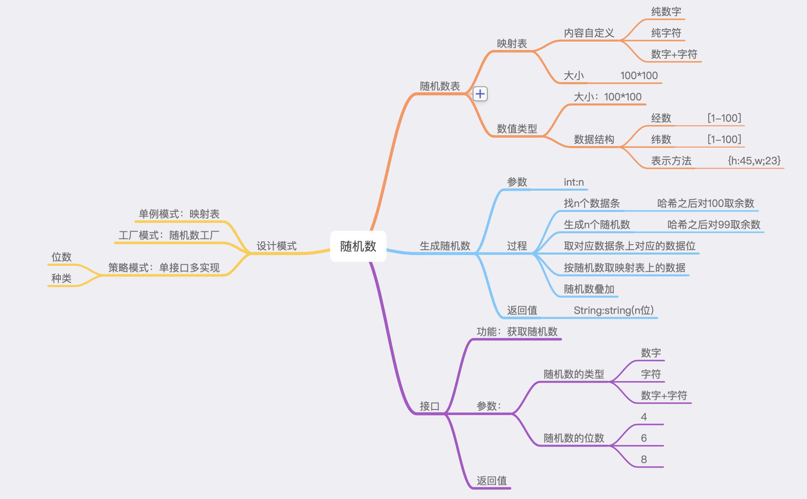

# 随机数的思路

## 看图

## 构建一张100*100的随机数表

|   | 1 | 2 | 3 | 4 | 5 | 6 | 7 | 8 | 9 | 10 |
| --- | --- | --- | --- | --- | --- | --- | --- | --- | --- | --- |
| 1 | * | * | * | * | * | * | * | * | * | * |
| 2 | * | * | * | * | * | * | * | * | * | * |
| 3 | * | * | * | * | * | * | * | * | * | * |
| 4 | * | * | * | * | * | * | * | * | * | * |
| 5 | * | * | * | * | * | * | * | * | * | * |
| 6 | * | * | * | * | * | * | * | * | * | * |
| 7 | * | * | * | * | * | * | * | * | * | * |
| 8 | * | * | * | * | * | * | * | * | * | * |
| 9 | * | * | * | * | * | * | * | * | * | * |
| 10 | * | * | * | * | * | * | * | * | * | * |

## 生成随机坐标

### 坐标的数据结构

   * 经度
   * 纬度

## 在随机数表中取出随机字符在叠加

## 使用方法

`
    
    public class Main {
        public static void main(String[] args) {
    
            CreateRandomNumber createRandomNumber;
    
            createRandomNumber = new CreateRandomNumber(2, 8);
    
            System.out.println(createRandomNumber.getRandomNumbers());
    
        }
    }

`

 